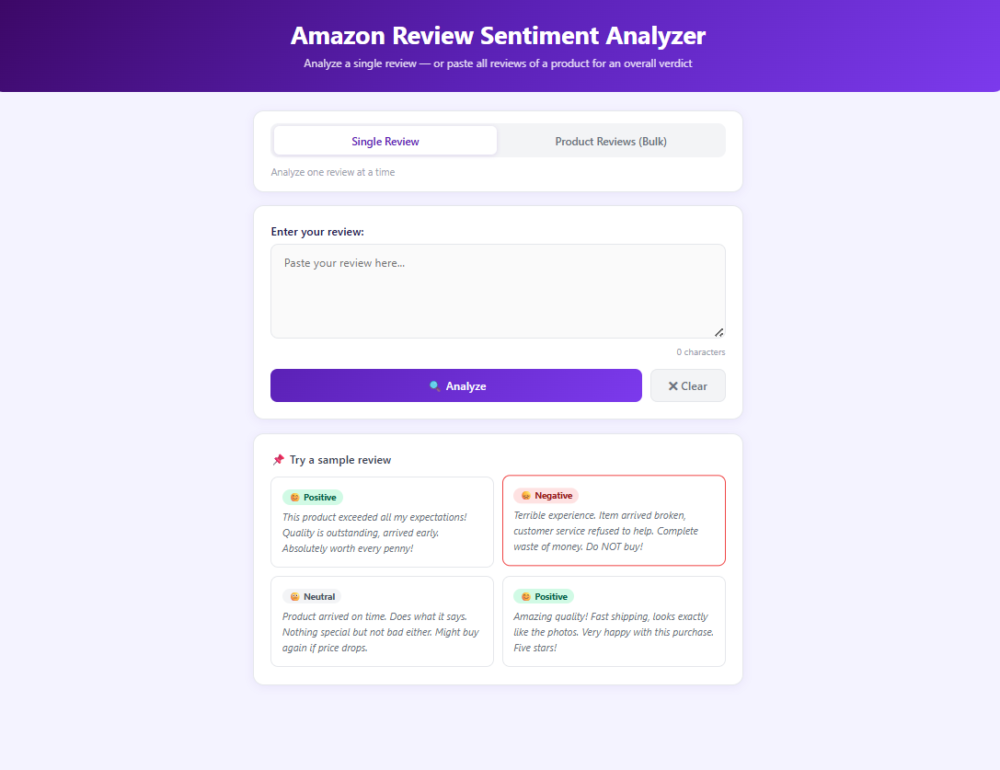
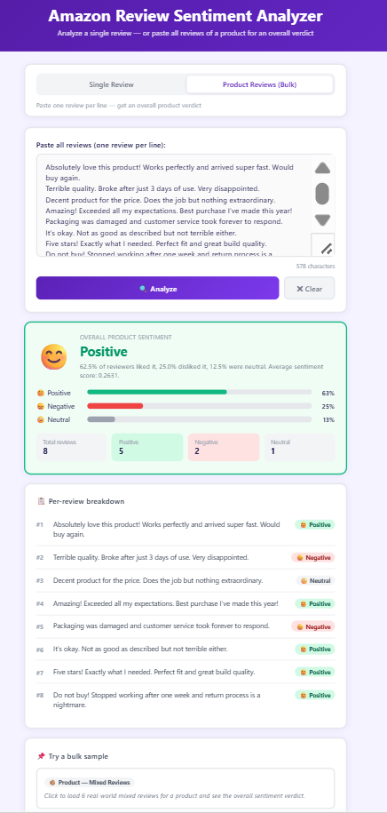
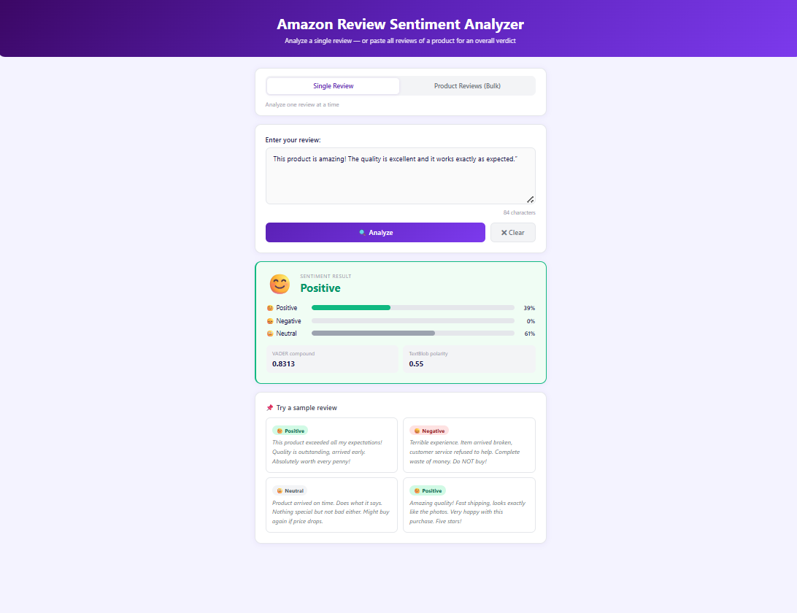
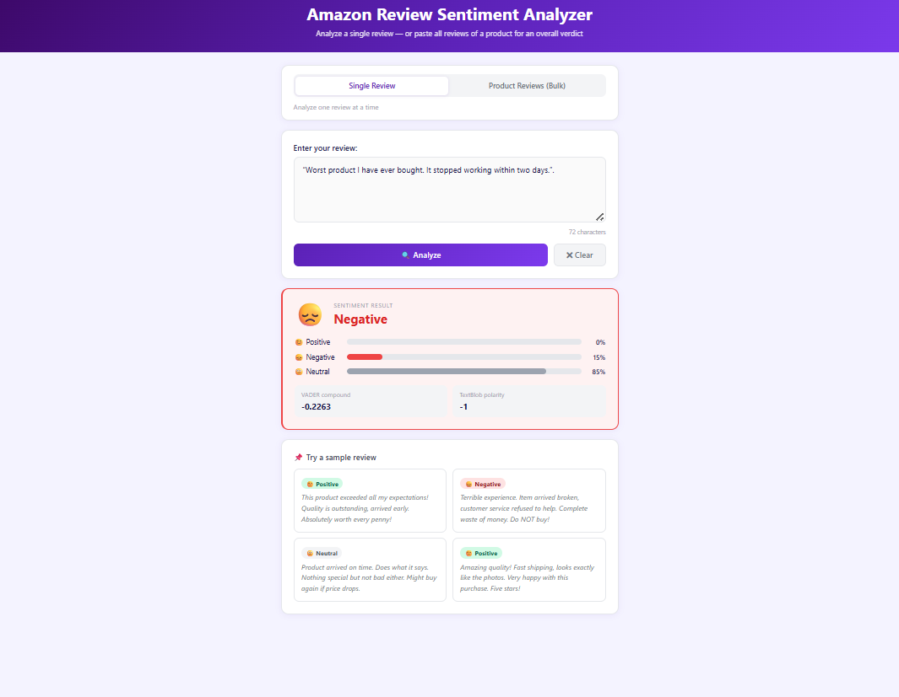

#  Sentiment Analysis Project

##  Project Overview

The Sentiment Analysis Project is a Machine Learning and Natural Language Processing (NLP) application that analyzes text and determines whether the sentiment expressed is Positive or Negative.

This project allows users to enter product reviews, comments, or feedback and instantly receive sentiment predictions. It is useful for businesses, customer feedback analysis, social media monitoring, and opinion mining.

# Live Demo

## https://sentiment-analysis-project-utl1.onrender.com/

##  Features

- Detect Positive and Negative sentiments
- User-friendly web interface
- Fast sentiment prediction
- Real-time text analysis
- Simple and easy-to-use application
- NLP-based sentiment classification


##  Technologies Used

- Python
- Flask
- Machine Learning
- Natural Language Processing (NLP)
- Scikit-Learn
- Pandas
- NumPy
- HTML
- CSS


##  Project Structure

```text
Sentiment_Analysis_Project/
│
├── screenshots/
│   ├── sentiment_analysis_home.png
│   ├── product_sentiment_input.png
│   ├── positive_sentiment_result.png
│   └── negative_sentiment_result.png
│
├── app.py
├── requirements.txt
├── templates/
├── static/
└── README.md
```


##  Installation

### Clone Repository

```bash
git clone https://github.com/chussainbee2026-commits/Sentiment_Analysis_Project.git
```

### Navigate to Project

```bash
cd Sentiment_Analysis_Project
```

### Install Dependencies

```bash
pip install -r requirements.txt
```

### Run Application

```bash
python app.py
```

### Open Browser

```text
http://127.0.0.1:5000
```


#  Application Screenshots

##  Home Page

The landing page of the Sentiment Analysis application.




##  Product Sentiment Input

Users can enter product reviews or feedback for sentiment prediction.




##  Positive Sentiment Result

Example of a review classified as Positive.




##  Negative Sentiment Result

Example of a review classified as Negative.




##  How It Works

1. User enters a product review.
2. Text preprocessing is performed.
3. NLP techniques extract useful features.
4. The trained Machine Learning model predicts sentiment.
5. Result is displayed as Positive or Negative.


##  Use Cases

- Product Review Analysis
- Customer Feedback Evaluation
- Social Media Monitoring
- Business Intelligence
- Opinion Mining
- Market Research


##  Future Enhancements

- Multi-Class Sentiment Classification
- Deep Learning Models
- Sentiment Visualization Charts
- User Authentication
- Database Integration
- API Deployment

## Authors

Hussain Bee & Akram Hussain

Aspiring Software Developers | Python Enthusiasts | Data Analytics & AI Learners

Passionate about Software Development, Data Analytics, Artificial Intelligence, Web Technologies, Automation, and Problem Solving. Dedicated to continuous learning and building innovative, scalable, and impactful solutions that deliver exceptional user experiences.

##  Support

If you found this project helpful, please give it a * on GitHub and share it with others.


##  License

This project is developed for educational and learning purposes.